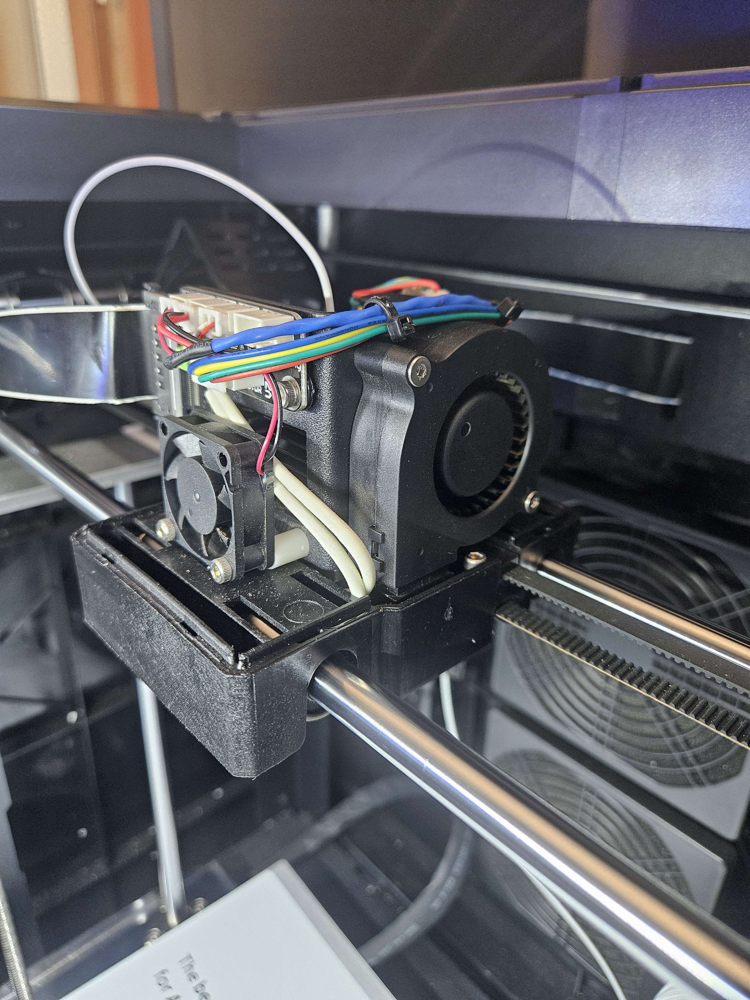
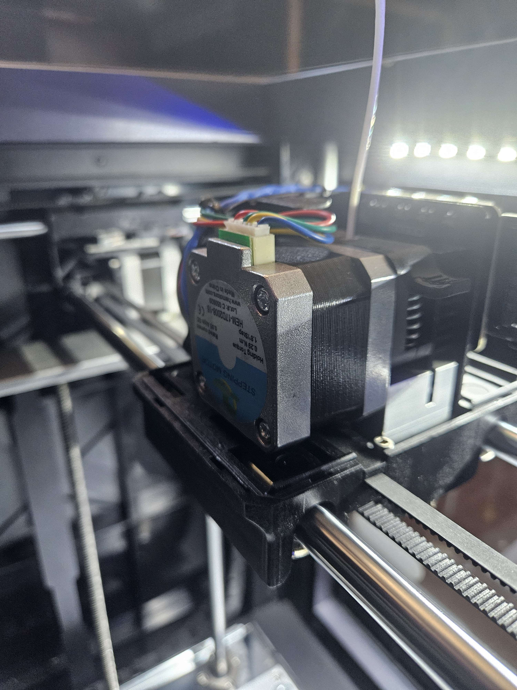
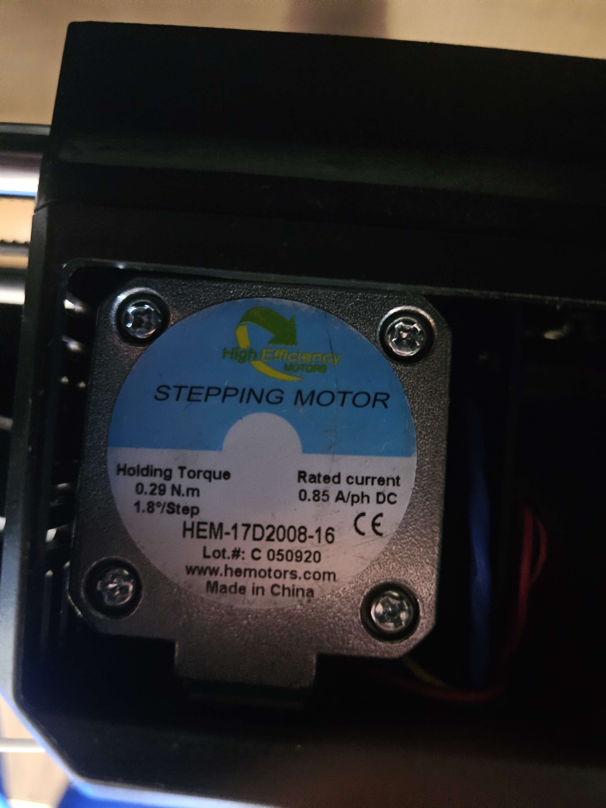
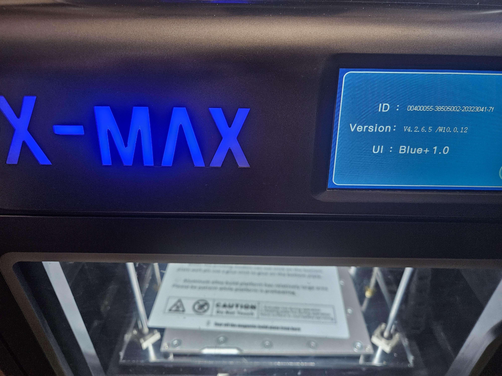

# QIDI X-MAX 1

## Slicer
- QIDI Slicer
- OrcaSlicer (preferred)

## Materials Tested
- PLA

## Overview of Typical Settings
- Nozzle size: 0.4 mm
- Layer height: 0.2 mm (`0.12 mm` not extensively tested)
- Bed temperature: 55–65°C
- Printing temperature: 185–200°C
- Typical print speeds: 50–60 mm/s
- Standard nozzle configuration with no enclosure modifications

---

## Printer Information & Hardware

### Extruder

| Front View | Rear View |
|---|---|
|  |  |

---

### Motor / Hardware Information

---

### Printer Version Information

---

## Firmware / Support Notes

The QIDI X-MAX I is an older printer model, but firmware updates and support resources are still available from QIDI support.

### Support Contacts
- `linda@qd3dprinter.com`
- `sophia@qd3dprinter.com`

### Warranty / After-Sales Support Requirements
Valid proof of purchase may be required, including:
- Order number from QIDI or authorized reseller
- Sales invoice
- Dated sales receipt
- Other valid proof of purchase documentation

---

## Notes

- Individual print folders contain their own dedicated `README.md` files documenting:
  - print settings
  - calibration adjustments
  - observed defects/issues
  - print quality findings
  - images and final results

- Main focus areas include:
  - print optimization
  - dimensional accuracy
  - overhang performance
  - ringing reduction
  - slicer experimentation
