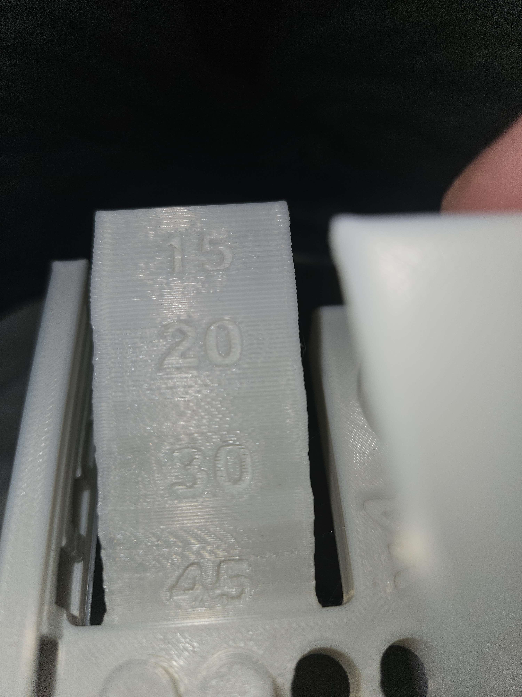
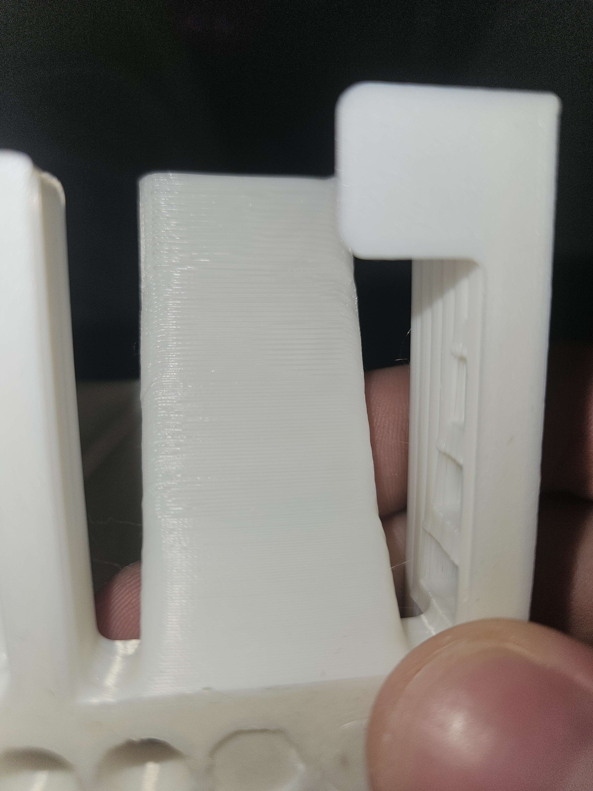
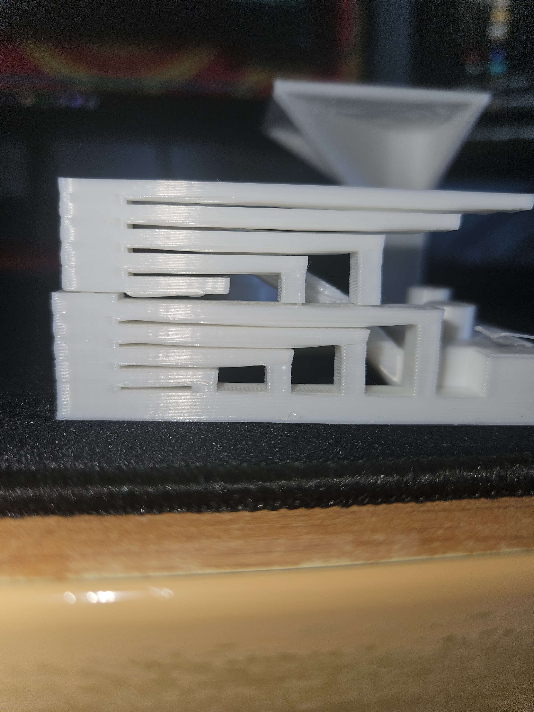

# FDM Test Benchmark

## Objective
General FDM calibration and print-quality benchmark focused on:
- bridging
- dimensional accuracy
- overhangs
- surface finish
- text readability
- stringing behavior

---

## Presets

### Process Profile
- `slicer_profiles/0.20mm Benchy and FDM.json`

### Filament Profile
- `PLA - no stringing v2.json`

### Notes
Settings were tuned similarly to the previously documented Benchy profile in an attempt to balance:
- bridge quality
- surface finish
- dimensional accuracy
- stringing reduction

---

## Observations

### Text & Surface Quality

- Text readability is acceptable but not perfectly sharp.
- Slight surface inconsistency remains visible across angled walls.
- Layer stacking is generally stable with only minor artifacts.

---

### Curved Surface & Ringing

- Minor ringing/ghosting artifacts remain visible on curved surfaces.
- Surface finish is relatively smooth overall.
- Dimensional consistency appears acceptable for general-purpose printing.

---

### Bridging Performance

- Bridging performance is functional but inconsistent on longer spans.
- Slight sagging remains visible underneath several bridge sections.
- Cooling performance still appears to be a limiting factor.

---

## Known Issues

- Stringing on upper sections was still relatively noticeable.
- Ringing artifacts remain consistently visible.
- Bridge quality degrades on longer unsupported spans.
- Fine text and sharp detail reproduction still require additional tuning.

---

## Possible Improvements

- Lower nozzle temperature slightly further for PLA.
- Tune retraction distance and speed more aggressively.
- Reduce outer-wall acceleration to minimize ringing.
- Increase cooling efficiency during bridges and overhangs.
- Reduce print speed during bridge-heavy sections.

---

## Overall Result

### Subjective Quality Rating
**6 / 10**

### Summary
The print is mechanically stable and generally usable, but still shows noticeable quality limitations in:
- bridging
- ringing reduction
- fine-detail sharpness
- stringing control

Current settings provide a decent baseline but still require additional optimization for cleaner high-detail prints.
