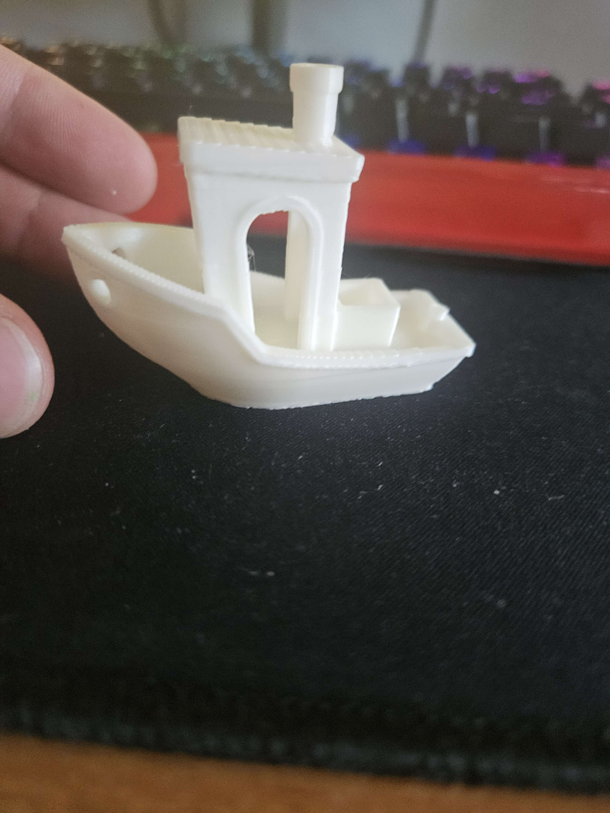

# 3D Benchy Test

## Objective
Baseline printer quality and calibration test.

---

## Slicer
OrcaSlicer

## Material
PLA

---

## Print Settings

| Setting | Value |
|---|---|
| Layer Height | 0.2 mm |
| Nozzle Temperature | 200°C |
| Bed Temperature | 60°C |
| Supports | Disabled |
| Nozzle Size | 0.4 mm |
| Wall Loops | 3 |
| Top Shell Layers | 5 |
| Bottom Shell Layers | 3 |
| Infill Density | 15% |
| Infill Pattern | Cross Hatch |
| Top Surface Pattern | Monotonic |
| Internal Solid Infill Pattern | Monotonic |
| Outer Wall Speed | 60 mm/s |
| Inner Wall Speed | 60 mm/s |
| Top Surface Speed | 20 mm/s |
| Travel Speed | 120 mm/s |
| First Layer Speed | 20 mm/s |
| Sparse Infill Speed | 60 mm/s |
| Support Speed | 30 mm/s |
| Bridge Flow Ratio | 0.8 |
| External Bridge Density | 100% |
| Internal Bridge Density | 100% |
| Thick External Bridges | Enabled |
| Thick Internal Bridges | Enabled |
| Slow Down for Overhangs | Enabled |
| Slow Down for Curled Perimeters | Enabled |
| Overhang Speeds | 20 / 15 / 8 mm/s |
| Seam Position | Back |
| X-Y Hole Compensation | 0.025 mm |
| X-Y Contour Compensation | 0.075 mm |

---

## Notes

- Focused on stable surface quality and reliable bridging.
- Recalibration was needed for dimensional accuracy and hole tolerances.
- Overhang artifacts are still visible around the curved door-frame arc section of the Benchy model.
- Minor ringing/ghosting artifacts are consistently present on outer walls.

---

## Observed Issues

- Slight stringing near roof section
- Minor ringing on side walls
- Overhang quality acceptable

---

## Findings

Reducing nozzle temperature improved stringing noticeably.

---

## Result

